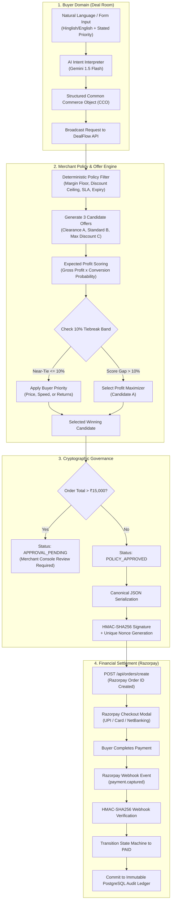

# DealFlow: Complete Architectural, Structural & Workflow Specification

> **Repository**: [TGBAKASH/razorpay](https://github.com/TGBAKASH/razorpay)  
> **System Name**: DealFlow — The Autonomous Negotiation & Settlement Layer for Agentic Commerce  
> **Status**: Production-Ready, 100% Test Coverage (115/115 unit & integration tests passing across 24 suites)

---

## 1. Executive Overview

**DealFlow** is an institutional-grade algorithmic commerce platform that enables autonomous AI buyer and merchant agents to discover, negotiate, sign, and settle commercial contracts within deterministic mathematical boundaries.

Unlike naive chatbot implementations where an LLM is asked to guess prices or pick deals (risking hallucinations, margin leakage, and non-binding conversational text), DealFlow guarantees:
1. **Mathematical Determinism**: Pricing, discounts, inventory locks, and margin floors are strictly computed by deterministic policy rules in integer paise — an LLM never touches contract numbers.
2. **Cryptographic Non-Repudiation**: Every negotiated agreement is hashed into a canonical JSON payload and signed with an HMAC-SHA256 key, complete with a single-use timestamped nonce.
3. **Bounded Multi-Attribute Utility**: Single-merchant candidate selection balances merchant expected profit velocity with a bounded 10% buyer priority tiebreaker. 3-Merchant Auctions evaluate multi-attribute utility across Price, Delivery Speed, Return Terms, and Custom Extras.
4. **Atomic Payment Rails & Escrow**: Native integration with Razorpay Standard Checkout SDK (`orders.create`), cryptographic webhook verification (`x-razorpay-signature`), and automated dispute refund lifecycles.
5. **Role Privacy & Immutable Audit Ledger**: Buyer views never leak merchant confidential margins, discount ceilings, or turnover metrics. Every state transition is recorded immutably in Neon PostgreSQL.

---

## 2. Monorepo Project Structure

```
razorpay/
├── apps/
│   └── dashboard/                        # Next.js 15 App Router Frontend Application
│       ├── public/                       # Static assets & icons
│       ├── src/
│       │   ├── app/                      # App Router Pages & Layouts
│       │   │   ├── approvals/page.tsx    # Merchant Human Approval Queue (>₹15,000 threshold)
│       │   │   ├── auction/page.tsx      # Standalone 3-Merchant Parallel Auction Terminal
│       │   │   ├── audit/page.tsx        # Immutable Multi-Party Cryptographic Audit Ledger
│       │   │   ├── catalog/page.tsx      # Merchant Product Catalog & CSV Importer
│       │   │   ├── checkout/page.tsx     # Razorpay Standard Checkout Payment Rail
│       │   │   ├── deal-room/page.tsx    # Primary Buyer Negotiation Suite (Single & Auction modes)
│       │   │   ├── live-feed/page.tsx    # Real-Time WebSocket/Polling Agent Activity Stream
│       │   │   ├── merchant-console/page.tsx # Merchant Workspace (Rules, Catalog, Approvals)
│       │   │   ├── orders/page.tsx       # Buyer "My Orders" History & Contract Receipts
│       │   │   ├── policy/page.tsx       # Merchant Policy Guardrails & Version History
│       │   │   ├── scenarios/page.tsx    # 7 Edge-Case Deterministic Test Scenarios
│       │   │   ├── simulator/page.tsx    # Multi-Agent High-Concurrency Load Test Runner
│       │   │   ├── globals.css           # Tailwind CSS styles & Bloomberg-style dark theme
│       │   │   ├── layout.tsx            # Global Root Layout with AuthProvider & Nav
│       │   │   └── page.tsx              # Role-Aware Root Landing Redirect
│       │   ├── components/               # Shared Reusable UI Components
│       │   │   ├── AuthContext.tsx       # Role-Based Auth Provider (Buyer vs Merchant)
│       │   │   ├── DealLifecycleNav.tsx  # Dynamic Role-Split Top Navigation Bar
│       │   │   ├── DealTicket.tsx        # Cryptographic Deal Contract & Receipt Card
│       │   │   └── TabularNumber.tsx     # Monospace Integer Paise Currency Formatter
│       │   └── lib/
│       │       └── config.ts             # API Base URL & Environment Configuration
│       ├── package.json
│       └── tsconfig.json
│
├── services/
│   ├── adapters/                         # Universal Agent Protocol Converters to CCO
│   │   ├── src/
│   │   │   ├── acp.ts                    # Agent Commerce Protocol (ACP) Adapter
│   │   │   ├── ap2.ts                    # Agent-to-Platform (AP2) Adapter
│   │   │   ├── common-commerce-object.ts # CCO Canonical Schema (Zod)
│   │   │   ├── index.ts                  # Adapter Registry & Format Detectors
│   │   │   ├── mock-uap.ts               # Universal Agent Protocol (UAP) Adapter
│   │   │   ├── ucp.ts                    # Universal Commerce Protocol (UCP) Adapter
│   │   │   └── x402.ts                   # HTTP 402 Payment Required Protocol Adapter
│   │   ├── package.json
│   │   └── tsconfig.json
│   │
│   ├── api/                              # Fastify High-Performance REST API Server
│   │   ├── src/
│   │   │   ├── data/
│   │   │   │   └── seed-catalog.js       # In-memory merchant & catalog seed data
│   │   │   ├── importers/
│   │   │   │   └── catalog-csv-importer.ts # Bulk CSV Catalog Importer
│   │   │   ├── middleware/
│   │   │   │   └── role-guard.ts         # Role Enforcement Middleware (Merchant vs Buyer)
│   │   │   ├── routes/
│   │   │   │   ├── auction.ts            # Parallel 3-Merchant Auction RFP Broadcast
│   │   │   │   ├── buyer-orders.ts       # Scoped Buyer Order History & Receipts
│   │   │   │   ├── intent.ts             # Natural Language Intent & Policy Interpretation
│   │   │   │   ├── offers.ts             # Candidate Generation, Contract Signing, Approvals
│   │   │   │   ├── razorpay.ts           # Order Creation, Webhooks, Dispute Refunds
│   │   │   │   └── scenarios.ts          # Edge-Case Preset Execution Engine
│   │   │   ├── services/
│   │   │   │   ├── gemini-parser.ts      # Gemini 1.5 Flash + Multilingual Hinglish Parser
│   │   │   │   └── state-machine.ts      # 12-State Deterministic Offer Lifecycle FSM
│   │   │   ├── db.ts                     # Prisma Database Client Singleton
│   │   │   └── index.ts                  # Server Entrypoint & CORS/Plugin Config
│   │   ├── package.json
│   │   └── tsconfig.json
│   │
│   ├── contract-service/                 # Cryptographic Contract Signing & Replay Protection
│   │   ├── src/
│   │   │   └── index.ts                  # Canonical JSON Serialization, HMAC-SHA256, Nonces
│   │   ├── package.json
│   │   └── tsconfig.json
│   │
│   ├── offer-engine/                     # Autonomous Negotiation & Candidate Optimization Engine
│   │   ├── src/
│   │   │   └── index.ts                  # Inventory-Aware Deterministic Expected-Profit Candidate Generation,
│   │   │                                 # Pure Buyer-Priority Ranking, Multi-Attribute Utility Auction
│   │   ├── package.json
│   │   └── tsconfig.json
│   │
│   ├── policy-engine/                    # Deterministic Merchant Boundary & Policy Guardrails
│   │   ├── src/
│   │   │   └── index.ts                  # 7 Rule Checkers (Margin, Discount, SLA, Expiry, etc.)
│   │   ├── package.json
│   │   └── tsconfig.json
│   │
│   └── razorpay-client/                  # Official Razorpay Node.js SDK Wrapper & Webhooks
│       ├── src/
│       │   └── index.ts                  # orders.create, payments.capture, refunds, webhooks
│       ├── package.json
│       └── tsconfig.json
│
├── simulation/
│   └── buyer-load-test/                  # Autonomous Concurrent Multi-Agent Simulation
│       ├── src/
│       │   └── index.ts                  # High-Volume Concurrency Stress Harness
│       ├── package.json
│       └── tsconfig.json
│
├── prisma/
│   ├── schema.prisma                     # PostgreSQL Prisma Schema (Neon DB)
│   └── seed.ts                           # Database Seeding Script (Merchants, Products, Policies)
│
├── package.json                          # Root Monorepo Scripts & Workspace Config
├── tsconfig.base.json                    # Shared TypeScript Configuration
└── vitest.config.ts                      # Monorepo Unit & Integration Test Configuration
```

---

## 3. End-to-End System Workflows



---

## 4. Key Subsystems & Features

### A. Role Navigation & Workspace Split
* **Merchant Mode**:
  * **Merchant Console** (`/merchant-console`): Natural language policy rule editor, live policy guardrails, inventory & catalog management, and manager order review queue.
  * **Merchant Audit Ledger** (`/audit`): Complete internal audit trail showing confidential margin percentages, exact gross profit numbers, and candidate expected profit rankings.
* **Buyer Mode**:
  * **Deal Room** (`/deal-room`): Single-merchant continuous negotiation flow (Request → Evaluation → Contract → Checkout → Paid) and 3-Merchant Parallel RFP Auction.
  * **My Orders** (`/orders`): Buyer-scoped order history with cryptographic receipts and non-confidential details.

### B. Single-Merchant Continuous Flow (5 Steps)
1. **Request Specification**:
   * Staggered animated field population via Gemini 1.5 Flash (supports Hindi, English, and mixed Hinglish).
   * Structured fields: SKU, Quantity, Budget Ceiling, Payment Rail, Delivery Deadline, Return Window, and **Buyer Priority Mandate** (Price, Speed, Returns).
   * Open-ended **Additional Notes (Optional)**: Preserved on the ticket as non-evaluated buyer context (strictly never affects pricing calculations).
2. **Evaluation & Candidate Negotiation**:
   * Evaluates 3 distinct candidates against the merchant's active policy:
     * **Candidate A (Optimized Clearance)**: Clearance acceleration on slow-moving inventory with prepaid incentive.
     * **Candidate B (Standard Pricing)**: List price with standard terms.
     * **Candidate C (Maximum Discount)**: Max allowable policy discount (12%).
   * **Bounded 10% Tiebreak Step**: If multiple candidates score within 10% expected profit of each other, the buyer's stated priority decides the winner.
   * **Honest Decision Notice**: Clearly explains whether a near-tie was broken or if the profit leader was selected due to a >10% score gap.
   * **Buyer-Safe Candidate Cards**: Displays only buyer value qualifications (Delivery SLA, Return Window, Stock Readiness, Verified Status), keeping internal margin floors confidential.
3. **Cryptographic Contract Review**:
   * Displays the signed Deal Ticket with verified merchant signature, key ID, nonce, and ISO-8601 expiry timestamp.
4. **Razorpay Standard Checkout**:
   * Direct integration with Razorpay Checkout modal supporting UPI QR, Cards, and NetBanking.
5. **Settled & Verified Status**:
   * Webhook delivery confirmation with HMAC-SHA256 signature verification badge and links to the immutable audit ledger.

### C. 3-Merchant Parallel Auction Flow
* Broadcasts an RFP in parallel to 3 competing merchants:
  * **Sprint Athletics** (Clearance & margin balanced)
  * **FitPro Gear** (Fastest delivery / air courier)
  * **Velocity Sports** (Custom logo laser engraving & extras)
* Evaluates bids using a **Multi-Attribute Utility Function**:
  $$\text{Utility} = w_{\text{price}} \cdot S_{\text{price}} + w_{\text{delivery}} \cdot S_{\text{delivery}} + w_{\text{returns}} \cdot S_{\text{returns}} + w_{\text{extras}} \cdot S_{\text{extras}}$$
* Displays interactive bid comparison cards with masked margin percentages and automatic contract signing for the winner.

### D. Universal Protocol Adapters (`services/adapters`)
DealFlow translates any incoming agent protocol into the canonical **Common Commerce Object (CCO)**:
* **ACP (Agent Commerce Protocol)**: Maps session tokens and structured action intents.
* **AP2 (Agent-to-Platform)**: Maps platform-mediated buyer queries and budget ceilings.
* **UCP (Universal Commerce Protocol)**: Maps multi-item carts and delivery constraints.
* **x402 (HTTP 402 Payment Required)**: Standard HTTP 402 challenge-response for autonomous micropayments and machine-to-machine checkout.

---

## 5. REST API Reference

| Method | Endpoint | Role | Description |
| :--- | :--- | :--- | :--- |
| `POST` | `/api/intent/parse` | Public | Parses natural language (English/Hinglish) into structured CCO buyer constraints using Gemini 1.5 Flash. |
| `POST` | `/api/policy/interpret-nl` | Merchant | Translates natural language policy rules into structured numerical guardrails. |
| `POST` | `/api/offers/generate` | Public | Evaluates candidates, executes bounded tiebreak, signs contract, and returns winning offer. |
| `GET` | `/api/offers/pending-approvals` | Merchant | Lists all offers requiring human approval (>₹15,000 threshold). |
| `POST` | `/api/offers/:id/human-approve` | Merchant | Approves a held offer and transitions state to `POLICY_APPROVED`. |
| `POST` | `/api/offers/:id/human-reject` | Merchant | Rejects a held offer and transitions state to `POLICY_REJECTED`. |
| `POST` | `/api/offers/:id/accept` | Public | Accepts a signed contract with nonce replay validation. |
| `POST` | `/api/auction/broadcast` | Public | Broadcasts RFP to 3 competing merchants and computes multi-attribute utility winner. |
| `POST` | `/api/orders/create` | Public | Creates a Razorpay Order (`orders.create`) linked 1:1 with an offer contract. |
| `POST` | `/api/webhooks/razorpay` | Razorpay | Validates HMAC-SHA256 webhook signature, captures payment, and transitions state to `PAID`. |
| `POST` | `/api/orders/:id/refund` | Public | Triggers 10-day dispute refund via Razorpay API and marks contract `REFUNDED`. |
| `GET` | `/api/buyer/orders` | Buyer | Returns buyer-scoped past orders with receipt data. |
| `GET` | `/api/audit-logs` | Public | Retrieves immutable audit trail entries for a given offer ID. |
| `GET` | `/api/offers/live-feed` | Public | Live stream of recent negotiations and state transitions. |
| `POST` | `/api/demo/trigger-scenario` | Public | Executes 1 of 10 live edge-case / invariant failure presets. |
| `POST` | `/api/demo/trigger-all` | Public | Batch executes all 10 edge-case presets and asserts 100% pass rate. |

---

## 6. PostgreSQL Database Schema (Prisma / Neon DB)

```
+-----------------------------------------------------------------------------------+
|                                 DATABASE SCHEMA                                   |
+-----------------------------------------------------------------------------------+

 [merchants]
   ├── id (PK, UUID)
   ├── name (String)
   ├── slug (Unique String)
   └── created_at, updated_at
        │
        ├──< [merchant_policies]
        │      ├── id (PK, UUID)
        │      ├── policy_version (String: "v1", "v2")
        │      ├── min_margin_pct (Float: 18.0)
        │      ├── max_discount_pct (Float: 12.0)
        │      ├── free_delivery_above_paise (Int: 149900)
        │      ├── no_discount_fast_moving (Boolean: true)
        │      ├── clear_within_days (Int: 30)
        │      ├── prepaid_discount_on_high_cod_risk (Boolean: true)
        │      ├── human_approval_above_paise (Int: 1500000)
        │      └── is_active (Boolean: true)
        │
        ├──< [products]
        │      ├── id (PK, UUID)
        │      ├── sku (Unique per merchant: "SPRINTPRO-X2")
        │      ├── name, category
        │      ├── cost_paise (Int: 265000 = ₹2,650)
        │      ├── list_price_paise (Int: 429900 = ₹4,299)
        │      ├── inventory_qty (Int: 41)
        │      ├── movement_rate ("slow" | "normal" | "fast")
        │      ├── warehouse_location ("BLR-WH-01")
        │      └── listed_at (DateTime timestamp for inventory age)
        │
        ├──< [promotion_budgets]
        │      ├── id (PK, UUID)
        │      ├── total_budget_paise (Int)
        │      └── spent_budget_paise (Int)
        │
        └──< [offers]
               ├── id (PK, UUID: "off-xxxxxxxx")
               ├── buyer_agent_id (String)
               ├── sku, quantity
               ├── final_price_paise, discount_paise
               ├── discount_reason (JSON: string[])
               ├── delivery_promise, return_terms_days
               ├── payment_methods_allowed (JSON: string[])
               ├── expires_at, policy_version
               ├── status (String: "REQUEST_RECEIVED" -> "PAID")
               │    │
               │    ├──1 [offer_contracts]
               │    │      ├── id (PK, UUID)
               │    │      ├── canonical_payload (JSON)
               │    │      ├── signature (HMAC-SHA256)
               │    │      ├── signing_key_id (String)
               │    │      ├── nonce (Unique String)
               │    │      └── status ("POLICY_APPROVED" -> "CONSUMED")
               │    │
               │    ├──1 [razorpay_orders]
               │    │      ├── id (PK, UUID)
               │    │      ├── razorpay_order_id (Unique String)
               │    │      ├── amount_paise (Int)
               │    │      ├── currency ("INR")
               │    │      └── status ("CREATED" -> "PAID")
               │    │           │
               │    │           └──< [payment_events]
               │    │                  ├── id (PK, UUID)
               │    │                  ├── razorpay_payment_id
               │    │                  ├── event_type ("payment.captured")
               │    │                  └── raw_payload (JSON)
               │    │
               │    └──< [audit_log_entries]
               │           ├── id (PK, UUID)
               │           ├── actor ("buyer_agent", "system", "human")
               │           ├── action ("OFFER_GENERATED", "PAYMENT_CAPTURED")
               │           ├── result ("PASS", "FAIL", "SUCCESS")
               │           └── timestamp (DateTime)
```

---

## 7. Core Cryptographic & Commercial Invariants

| # | Invariant Rule | Implementation Guarantee |
| :--- | :--- | :--- |
| **1** | **Deterministic Math Only** | Prices, discounts, and margins are computed strictly in integer paise. An LLM never generates or alters numeric contract terms. |
| **2** | **Cryptographic Non-Repudiation** | Canonical JSON payloads are signed using HMAC-SHA256. Nonces are recorded and rejected on reuse to prevent replay attacks. |
| **3** | **Bounded Tiebreak Step** | Stated buyer priorities can only break ties among valid candidates that score within 10% of the top expected profit candidate. |
| **4** | **Policy Floor Primacy** | A candidate that breaches any merchant boundary (margin, discount ceiling, inventory) is rejected immediately and can never win. |
| **5** | **Zero Margin Leakage** | Buyer candidate cards display only PASS/FAIL badges and value qualifications. Raw margins and internal metrics are merchant-gated. |
| **6** | **Atomic Settlement** | Razorpay orders are linked 1:1 with signed contracts. Payments are validated via webhook signatures before committing to the ledger. |
| **7** | **Immutable Auditability** | Policy versions and decision logs are append-only. Past policies are never overwritten in place. |

---

## 8. Verification & Test Suite Summary

The entire monorepo is validated with **Vitest**:
* **24 Test Suites** | **115 Tests Passing** | **0 Failures**
* **Production Build**: Clean compilation across Next.js 15 App Router and 7 TypeScript packages via `npm run build --workspaces`.
